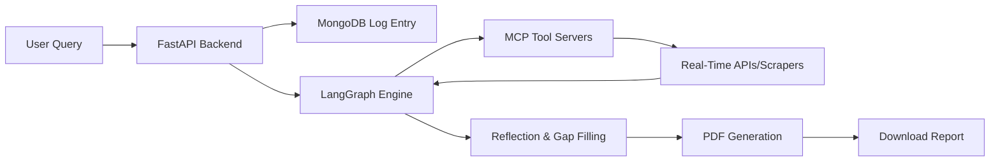

# Architectural Documentation: MarketScout

This document provides a comprehensive, high-level architectural analysis of the **MarketScout** system. It is designed to give you a clear mental model of how the components interact, why the system is designed this way, and how to explain this architecture confidently in technical interviews or to other engineers.

---

## 1. Project Overview

### What problem does this project solve?
Traditional market research is a slow, manual, and fragmented process. Analysts must search search engines, monitor social platforms (X/Twitter), review videos (YouTube transcripts), and scrape web pages to extract insights. **MarketScout** automates this by orchestrating a multi-agent AI system that collects, cross-references, refines, and compiles deep research reports (Industry, Competitive, Market Gap, Barriers, Sales Forecast, and Target Market analyses) from multiple real-time sources.

### Who are the target users?
*   **Entrepreneurs & Startups**: Rapidly validating new business ideas.
*   **Product Managers**: Analyzing market gaps, competitor features, and barrier entries.
*   **Market Analysts**: Generating structured research briefings without manual copy-pasting.

### What is the main workflow?


---

## 2. Overall Architecture

The application is built around a **Modular Micro-Services & Agentic** architecture. It separates the execution of the agent state machine (core brain) from the tool execution layer (data collectors) using the **Model Context Protocol (MCP)**.

```
                            ┌────────────────┐
                            │     Users      │
                            └───────┬────────┘
                                    │ HTTP / WebSocket
                                    ▼
                     ┌──────────────────────────────┐
                     │   Frontend (React/Next.js)   │
                     └──────────────┬───────────────┘
                                    │
                       HTTP POST    │ WebSocket
                       /analysis    │ /ws/research/{id}
                                    ▼
                     ┌──────────────────────────────┐
                     │      Backend (FastAPI)       │
                     │          (Port 8000)         │
                     └─────┬────────┬────────┬──────┘
                           │        │        │
                           │        │        │ Run LangGraph Engine
                Write/Read │        │        └──────────────┐
                 Metadata  │        │                       │
                           ▼        │ Serve PDF             ▼
                     ┌───────────┐  │ /reports/... ┌─────────────────┐
                     │  MongoDB  │  │              │    LangGraph    │
                     │  Database │  │              │  Agent workflow │
                     └───────────┘  │              └────────┬────────┘
                                    ▼                       │
                             ┌─────────────┐                │ Run Tools
                             │ Local PDF   │◄───────────────┤ (MCP SSE Client)
                             │ Storage     │ (Saves PDF)    │
                             └─────────────┘                ▼
                                                   ┌─────────────────┐
                                                   │   MCP Gateway   │
                                                   │   (FastAPI)     │
                                                   │   (Port 5001)   │
                                                   └────────┬────────┘
                                                            │ SSE Transports
                                                            ▼
                                                   ┌─────────────────┐
                                                   │   FastMCP Tool  │
                                                   │     Servers     │
                                                   └────────┬────────┘
                                                            │
                     ┌──────────────────────────────────────┼──────────────────────────────────────┐
                     │                      │               │                      │               │
                     ▼                      ▼               ▼                      ▼               ▼
             ┌──────────────┐        ┌──────────────┐ ┌───────────┐        ┌──────────────┐
             │ google_tools │        │ scraper_tools│ │youtube_tools │     │   x_tools    │
             └──────┬───────┘        └─────┬────────┘ └──────┬───────┘     └──────┬───────┘
                    │                      │                 │                    │
                    ▼                      ▼                 ▼                    ▼
                Google APIs            Crawl4AI            YouTube           X API v2 &
              (Search, Trends,        Scraper API        Transcripts       SERP Fallback
              Shopping, News)
```

### Architectural Tiers:
1.  **Frontend (React/Next.js)**: Responsible for user input, displaying a live agent execution log (streamed via WebSockets), and rendering the final report downloads.
2.  **Backend (FastAPI, Port 8000)**: Serves as the orchestrator. Handles REST endpoints for starting analyses and retrieving completed files, runs the WebSocket endpoint for progress logs, and spawns asynchronous Python worker tasks.
3.  **Agent Orchestrator (LangGraph)**: The "brain" that executes a cyclic, map-reduce-based graph to compile, reflect, search, and merge information.
4.  **Database (MongoDB)**: Keeps records of analysis requests, metadata, query configs, timestamps, and current execution statuses.
5.  **MCP Gateway Server (FastAPI, Port 5001)**: Implements the **Model Context Protocol (MCP)** using the Server-Sent Events (SSE) transport protocol. It aggregates and exposes independent tool servers as a unified registry.
6.  **FastMCP Tool Servers (Modular)**: Containerized or decoupled tools running searches against Google SerpAPI, scraping web content using Crawl4AI, fetching YouTube transcripts, or querying X (Twitter) via API v2 and SERP web fallback.

---

## 3. End-to-End Request Flow

Here is exactly what happens when a user requests a market analysis:

```
User (UI)       Frontend        FastAPI (8000)       MongoDB       LangGraph Engine      MCP Gateway (5001)    LLM (Gemini)
   │               │                  │                 │                  │                     │                  │
   │─[1] Query ───>│                  │                 │                  │                     │                  │
   │   & Report    │─[2] POST /anal.─>│                 │                  │                     │                  │
   │   Type        │                  │─[3] Insert ────>│                  │                     │                  │
   │               │                  │     Pending     │                  │                     │                  │
   │               │<─[4] Return ID───│                 │                  │                     │                  │
   │               │                  │─[5] Spawn Async Task ─────────────>│                     │                  │
   │               │─[6] Open WS ────>│                                    │                     │                  │
   │               │                  │─[7] Pipe Queue Updates ───────────>│                     │                  │
   │               │                  │                                    │─[8] Initial ReAct ─>│                  │
   │               │                  │                                    │     Agent Pass      │─[9] Run Tools ──>│
   │               │                  │                                    │                     │<─[10] Results ───│
   │               │                  │                                    │─[11] Stream log ───>│                  │
   │               │<─[12] Log Msg ───│<─ ─ ─ ─ ─ ─ ─ ─ ─ ─ ─ ─ ─ ─ ─ ─ ─ ─│                     │                  │
   │               │                  │                                    │                                        │
   │               │                  │                                    │─[13] Reflection & Gaps Loop (Map/Red) ─│
   │               │                  │                                    │     (Find gaps -> Parallel searches    │
   │               │                  │                                    │      -> Merge details into draft)      │
   │               │                  │                                    │                                        │
   │               │                  │                                    │─[14] Generate PDF ─>│                  │
   │               │                  │─[15] Update Completed Status ─────>│                     │                  │
   │               │                  │      & path                        │                     │                  │
   │               │<─[16] Close WS ──│                                    │                     │                  │
   │               │                  │                                    │                     │                  │
   │<─[17] Ready ──│                  │                                    │                     │                  │
   │               │─[18] GET /rep.──>│                                    │                     │                  │
   │<─[19] PDF ────│<─[20] Send PDF ──│                                    │                     │                  │
```

1.  **POST Trigger**: The user submits a research topic. The Frontend posts to `/analysis`.
2.  **Job Database Registry**: FastAPI writes the request to MongoDB with status `pending` and returns an `analysis_id` string.
3.  **Task Launch**: FastAPI creates an asynchronous task (`asyncio.create_task`) and sets up an in-memory queue (`asyncio.Queue`) for streaming messages.
4.  **WebSocket Binding**: The Frontend opens a WebSocket connection to `/ws/research/{analysis_id}`. The backend listens to the queue and immediately pipes any incoming strings down the socket.
5.  **Agent ReAct Stage**: The agent first runs a traditional ReAct loop using Google Search, web scraping, etc., to write a preliminary base draft.
6.  **LangGraph Reflection Loop (Self-Correction)**:
    *   **Find Gaps (Node)**: The LLM analyzes the draft, outlines missing statistics, and outputs a JSON containing specific research gaps.
    *   **Continue & Map (Edge)**: Evaluates the gaps and sends parallel (`Send` API) workers to target specific tools (`fill_gaps` Node).
    *   **Fill Gaps (Node)**: Individual instances of the ReAct agent fetch the missing data in parallel via the MCP servers.
    *   **Merge (Node/Reduce)**: The engine receives all parallel answers, merges them into the main report text, and repeats the cycle if limits are not reached.
7.  **Compilation & Storage**: Once complete, the markdown report is parsed into a PDF section, saved to `/reports/{id}/{type}.pdf`, and MongoDB is updated with the file's location.
8.  **Closure & Download**: The queue receives a `None` sentinel closing the WebSocket. The UI triggers a browser download pointing to `/reports/{rid}/{file_id}`.

---

## 4. Component Breakdown

*   **FastAPI Backend (`server.py`)**: 
    *   Acts as the system API Gateway.
    *   Responsible for route mappings, request validations via Pydantic schemas (`AnalysisSchema`), and background task management using the Python `asyncio` event loop.
*   **LangGraph Orchestrator (`agents/graph.py` & `agents/create_agent.py`)**: 
    *   Translates research requirements into an execution state machine.
    *   Implements the **Map-Reduce** design pattern (splitting gap searches in parallel and reducing them back to a single report).
    *   Applies a rate-limiter aware model invoker with exponential backoff (`call_llm_with_backof¯ˀf`) to prevent LLM rate limits (`429` / `QuotaExhausted` errors).
*   **FastMCP Tool Servers (`mcp_servers/`)**:
    *   Runs a separate FastAPI app on port 5001 that mounts Server-Sent Events (SSE) endpoints.
    *   Exposes tools like web scraping (`crawl4ai`), YouTube transcripts (`youtube_transcript_api`), social feeds (X API v2 with SERP fallback), and search indexes (SerpAPI).
*   **Database (MongoDB)**: 
    *   MongoDB holds document states. Since research query structures, output report schemas, and logging arrays vary heavily by industry, a NoSQL structure fits perfectly.
*   **Background Jobs**: 
    *   Async tasks run within FastAPI's process space. They stream logs to clients using queues without blocking HTTP thread handlers.

---

## 5. Folder Structure

```
server/
├── server.py              # Main API entrypoint, routes (HTTP/WS), and task hooks
├── requirements.txt       # Dependencies (FastAPI, PyMongo, LangGraph, Crawl4AI, etc.)
├── agents/                # Core LLM brain logic
│   ├── create_agent.py    # Assembles initial ReAct agent and the LangGraph orchestrator
│   ├── graph.py           # Defines the LangGraph nodes, edges, map-reduce, and compilation
│   ├── state.py           # AgentState definition and custom list reducer (with DELETE reset support)
│   └── utils.py           # LLM rate limiting (InMemoryRateLimiter) & exponential backoff retry logic
├── database/              # Database adapter
│   ├── db.py              # MongoClient connection and database instance initialization
│   └── schema.py          # Pydantic schemas (AnalysisSchema) and Enums (Status, AnalysisType)
├── mcp_servers/           # Model Context Protocol tier (Port 5001)
│   ├── main.py            # Mounts all individual tool servers onto unified SSE endpoints
│   ├── google_tools/      # Google Search, Google Shopping, Google News, and Google Trends
│   ├── scraper_tools/     # Crawler engine powered by Crawl4AI
│   ├── youtube_tools/     # YouTube video transcript retrieval
│   └── x_tools/           # X (Twitter) tweet search, profile lookup & engagement metrics
├── prompts/               # Domain-specific instructions
│   ├── industry.py        # System prompt blueprints for market reports
│   └── competitor.py      # Prompt templates for competitive gap analysis
└── reports/               # Output directory where generated PDFs are stored locally
```

---

## 6. Data Flow

```
                      Raw User Prompt + Report Type
                                   │
                                   ▼
                      [MongoDB AnalysisSchema Entry]
                                   │
                                   ▼
                      [Initial ReAct Agent State]
                                   │
                                   ▼
                      [Base Research Draft String]
                                   │
                         ┌─────────┴─────────┐
                         ▼                   ▼
                 [Reflection LLM]    [Knowledge Gaps JSON]
                         │                   │
                         ▼                   ▼
           ┌───────────────────────────────────────────────┐
           │ Map: Parallel FastMCP Tool Executions         │
           │ (Crawlers, Youtube transcripts, Web Scrapes)  │
           └───────────────────────┬───────────────────────┘
                                   │
                                   ▼
                   [Collected Data Snippets Array]
                                   │
                                   ▼
                  [Reduce: Merge gaps into draft]
                                   │
                                   ▼
                    [Final Completed Report Draft]
                                   │
                                   ▼
                       [Markdown-PDF Compiler]
                                   │
                                   ▼
                    [Storage & Server Output PDF]
```

---

## 7. API Design

The project implements two key API designs: **Client-facing Gateway APIs** and **Internal Tool APIs**.

### Client-Facing REST & WebSocket (FastAPI)
*   `POST /analysis`: Creates an analysis record. Exposes a payload containing `{query: string, analysis_type: string}`. Returns `{id: string, status: "created"}`.
*   `GET /analysis/{analysis_id}`: Retrieves current research status, metadata, and final PDF links.
*   `WS /ws/research/{request_id}`: Standard WebSocket stream piping real-time agent output from the queue.
*   `GET /reports/{rid}/{file_id}`: Serves compiled PDFs with path traversal checks.

### Internal Tool APIs (Model Context Protocol SSE)
Tools are decoupled using the **Model Context Protocol (MCP)**.
*   The main server connects to `http://localhost:5001/mcp/{tool_name}/sse` to consume tools.
*   By using standard `MultiServerMCPClient`, the agent queries a list of tools from the MCP registry dynamically at startup, wrapping remote endpoints into LangChain `BaseTool` models.

---

## 8. Database Design

Since MongoDB is a document database, data is stored as schema-flexible JSON files within the `market_analysis` database.

### `analyses` Collection
```json
{
  "_id": ObjectId("66967406a0df01025547cb0b"),
  "query": "Autonomous Drone Delivery for Groceries",
  "analysis_type": "Market Gap Report",
  "status": "completed",
  "created_at": "Thu Jul 16 13:58:45 2026",
  "report_path": "66967406a0df01025547cb0b/Market Gap Report.pdf"
}
```
*   **Schema Fields**:
    *   `_id`: MongoDB unique identifier used to bind WebSocket sessions and directory file naming.
    *   `query`: The original user prompt.
    *   `analysis_type`: Dictates which prompt and agent config is triggered.
    *   `status`: State tracking. (Allowed values: `pending`, `in_progress`, `completed`, `failed`).
    *   `created_at`: Creation timestamp.
    *   `report_path`: Absolute path or download key pointing to the compiled PDF document.

---

## 9. Authentication & Security

1.  **CORS Safety**: Explicit origin checks restrict browser-level executions to authenticated local ports (`localhost:3000`/`3000`).
2.  **Path Traversal Prevention**: Serving files locally exposes path risks. If a user queries `/reports/../../etc/passwd`, it can leak system keys. The backend enforces a strict filter:
    ```python
    if ".." in file_id:
        raise HTTPException(status_code=400, detail="Bad path")
    ```
3.  **Transient Failure Retries & Rate Limiter Security**: Protects LLM credentials by wrapping executions with an exponential backoff controller (`call_llm_with_backoff`) and setting `InMemoryRateLimiter` limits.

---

## 10. Deployment Architecture

To host this application in a production environment, the following configuration is recommended:

```
                            ┌────────────────────────┐
                            │      Load Balancer     │
                            └───────────┬────────────┘
                                        │
                         ┌──────────────┴──────────────┐
                         ▼                             ▼
              ┌────────────────────┐        ┌────────────────────┐
              │  FastAPI Backend   │        │  FastAPI Backend   │
              │     (Instance A)   │        │     (Instance B)   │
              └──────────┬─────────┘        └──────────┬─────────┘
                         │                             │
                         │    Submit Worker Tasks      │
                         └──────────────┬──────────────┘
                                        ▼
                                ┌──────────────┐
                                │ Redis Broker │
                                └──────┬───────┘
                                       │
                         ┌─────────────┴─────────────┐
                         ▼                           ▼
              ┌────────────────────┐      ┌────────────────────┐
              │  Celery Worker A   │      │  Celery Worker B   │
              └──────────┬─────────┘      └──────────┬─────────┘
                         │                           │
              ┌──────────┴───────────────────────────┴──────────┐
              ▼                                                 ▼
     ┌──────────────────┐                              ┌──────────────────┐
     │  MongoDB Atlas   │                              │   AWS S3 Bucket  │
     │  (Database Host) │                              │  (PDF Documents) │
     └──────────────────┘                              └──────────────────┘
```

*   **Hosting Platform**: AWS ECS (Fargate) or Google Cloud Run for elastic scaling.
*   **Queue Management (Production Grade)**: Moving off FastAPI `asyncio` task queues. In production, we deploy a **Redis** message broker and run workers on **Celery** or **Arq** to handle the agent graphs. This ensures that if a backend container crashes, research tasks are not lost.
*   **Database**: Managed **MongoDB Atlas** with automated backups and replica sets.
*   **Object Storage**: Transition local `reports/` file writes to an **Amazon S3** or **Google Cloud Storage** bucket for durable document storage.
*   **CI/CD**: GitHub Actions building Docker images for the main server and tool services, pushing to Amazon ECR, and triggering rolling updates on ECS.

---

## 11. Key Design Decisions (Pros vs. Cons)

### 1. LangGraph Framework
*   **Why**: Implementing iterative reflection, self-correction, and search loops is difficult to manage in linear chains. LangGraph treats agent states as a directed cyclic graph with native support for state recovery, parallel loops, and map-reduce.
*   **Pros**: Highly structured; state changes are transactional; easily handles branching and parallel searches.
*   **Cons**: Steeper learning curve; high token consumption due to cyclic iterations.

### 2. Micro-servicing Tools via MCP (Model Context Protocol)
*   **Why**: Separates tool interfaces (scraping libraries, API authentications) from the core AI engine.
*   **Pros**: Decouples dependencies. Upgrading Scraping tools (e.g., Crawl4AI) won't break the agent graph. Allows tool testing independent of LLM connectivity.
*   **Cons**: Adds network overhead (HTTP/SSE handshake) between port 8000 and port 5001.

### 3. Server-Sent Events (SSE) Transport for MCP
*   **Why**: SSE operates over standard HTTP, making it simpler to set up behind firewalls and load balancers compared to custom WebSocket setups for tool interfaces.

---

## 12. Scalability to 1 Million Users

If MarketScout scaled to 1 million users, we would encounter bottlenecks in three primary areas: **Agent Execution**, **Scraping Rate Limits**, and **Storage**. Here is how we would scale:

1.  **Distributed Task Queues**: 
    *   *Bottleneck*: Running `asyncio.create_task` consumes RAM. A spike in requests would run the host out of memory.
    *   *Solution*: Offload the execution of the agent graph to a dedicated worker pool (Celery/Redis or Arq). Backend servers should only accept requests, write metadata, and return immediately.
2.  **Web Scraping & Proxy Networks**:
    *   *Bottleneck*: Crawling websites (Crawl4AI) from a single host IP causes rapid IP blocking and CAPTCHA locks.
    *   *Solution*: Route all scraping tools through a rotating proxy provider (like Bright Data or ScrapingBee) and cluster Crawl4AI instances using headless browser pools (e.g., Browserless.io).
3.  **State Persistence & WebSocket Scaling**:
    *   *Bottleneck*: WebSockets are stateful and bound to a single backend instance. If Instance A has the WS connection, but Instance B executes the Celery worker, logs cannot easily bridge.
    *   *Solution*: Implement a **Redis Pub/Sub** channel. Workers publish execution logs to Redis, and the FastAPI instances subscribe to Redis and stream logs down their respective WebSockets.
4.  **Durable File Storage**:
    *   *Bottleneck*: Storing PDFs on local servers fails in multi-server systems (Instance A can't serve a PDF saved on Instance B).
    *   *Solution*: Stream reports directly to an AWS S3 bucket and serve them to users via pre-signed URLs.

---

## 13. Interview Explanation Guide

Use this structure to pitch this architecture in a **5-minute interview answer**:

> "For my self-built project, MarketScout, I designed and built an AI-driven agentic research platform that automates market analysis. 
> 
> **The Problem**: Market research is highly fragmented, requiring analysts to search social networks, video comments, and scrape websites manually.
> 
> **The Architecture**: I built a micro-service system separating core agent orchestration from data extraction. The frontend is built on React, which connects to a FastAPI gateway. The gateway manages metadata using MongoDB and offloads research tasks to an asynchronous engine.
> 
> To run the research workflow, I chose **LangGraph**. It implements a self-correcting **Map-Reduce** pattern: the agent writes a draft, reflects on its own outputs to identify information gaps, initiates parallel search queries, and merges the results back into a final PDF report.
> 
> **Model Context Protocol (MCP)**: To keep tools modular, I decoupled all scraping, YouTube, and Google integrations into separate **FastMCP** micro-services communicating over SSE. This isolates core reasoning logic from external API dependencies and network scrapers.
> 
> **Key Decisions**: I chose Websockets for real-time progress logging so users see the agent's research steps dynamically. I also added exponential backoff on model calls to guard against API rate limits.
> 
> **If I were to scale this to 1 million users**: I would swap out the local asyncio queues for a distributed worker pool using Redis and Celery, shift local report storage to Amazon S3, and route scraping requests through rotating proxy networks to bypass IP restrictions."

---

## 14. Systems Architecture Diagram

```
                             ┌────────────────┐
                             │     Users      │
                             └───────┬────────┘
                                     │ HTTP / WebSocket (Port 8000)
                                     ▼
                          ┌─────────────────────┐
                          │   React Frontend    │
                          └──────────┬──────────┘
                                     │
                  ┌──────────────────┴──────────────────┐
                  │ POST /analysis                      │ WS /ws/research/...
                  ▼                                     ▼
       ┌─────────────────────┐               ┌─────────────────────┐
       │   FastAPI Backend   │──────────────>│   WebSocket Queue   │
       │     (Port 8000)     │               │     Streamer        │
       └──────────┬──────────┘               └──────────┬──────────┘
                  │                                     │
                  ├──────────────────┐                  │ Streams Real-time
                  │ Writes Metadata  │                  │ Progress
                  ▼                  ▼                  ▼
          ┌──────────────┐   ┌──────────────┐   ┌──────────────┐
          │   MongoDB    │   │  LangGraph   │   │  Frontend    │
          │   Database   │   │  Engine      │   │  UI Console  │
          └──────────────┘   └──────┬───────┘   └──────────────┘
                                    │
                                    │ Resolves Tools via SSE Client
                                    ▼
                          ┌─────────────────────┐
                          │     MCP Gateway     │
                          │     (Port 5001)     │
                          └──────────┬──────────┘
                                     │
            ┌────────────────────────┼────────────────────────┐
            ▼                        ▼                        ▼
     ┌──────────────┐         ┌──────────────┐         ┌──────────────┐
     │ Google Tools │         │ Reddit Tools │         │ Scraper Tool │
     └──────┬───────┘         └──────┬───────┘         └──────┬───────┘
            │                        │                        │
            ▼                        ▼                        ▼
       Google APIs              Reddit JSON               Crawl4AI
     (Search, Trends)           Public Search          Web Crawler
```

---

## 15. Getting Started & Local Development

### Prerequisites
- **Python**: Python 3.10 or 3.11 is recommended.
- **MongoDB**: A running MongoDB instance (locally via Community Edition or in the cloud using MongoDB Atlas).
- **API Keys**:
  - `GOOGLE_API_KEY`: Required if using Google Gemini models.
  - `SERP_DEV_API_KEY` (or `SERP_API_KEY`): Required for Google Search and Trend tool operations.
  - `HUGGINGFACEHUB_API_TOKEN`: Required if using Hugging Face models.

### Local Installation
1. **Clone/Navigate to the Server Directory**:
   ```bash
   cd server
   ```
2. **Create and Activate a Virtual Environment**:
   ```bash
   python3 -m venv .venv
   source .venv/bin/activate
   ```
3. **Install Dependencies**:
   ```bash
   pip install --upgrade pip
   pip install -r requirements.txt
   ```
4. **Environment Configuration**:
   Copy `.env.example` to `.env` and fill in the required keys:
   ```bash
   cp .env.example .env
   ```

### Running the Application Locally
To run the full suite, you need to start your MongoDB instance, the Model Context Protocol (MCP) server, and the main FastAPI server.

1. **Start MongoDB**:
   Make sure MongoDB is running. If installed via Homebrew on macOS:
   ```bash
   brew services start mongodb-community
   ```
2. **Start the MCP Gateway & Tool Servers (Port 5001)**:
   ```bash
   python -m mcp_servers.main
   ```
3. **Start the FastAPI Backend Orchestrator (Port 8000)**:
   ```bash
   python server.py
   ```

### Testing the Setup
You can access the FastAPI Swagger UI documentation at `http://localhost:8000/docs` to test endpoints such as `POST /analysis` and `GET /analysis/{analysis_id}`.

---

## 16. Multi-Model Pipeline & Configuration

MarketScout supports a configurable multi-model pipeline where different steps of the research workflow can be routed to different LLM models (Google Gemini, Groq, Jan AI, and Hugging Face).

### Multi-Model Settings in `.env`
You can configure different models for distinct pipeline stages:
- `MULTIPURPOSE_MODEL`: General purpose fallback / task model (default: `jan-v1-4b`).
- `GOOGLE_MODEL`: Primary Google Gemini model (default: `gemini-2.0-flash`).
- `GROQ_MODEL`: Primary Groq model (default: `llama-3.3-70b-versatile`).
- `GROQ_FALLBACK_MODEL`: Groq fallback model (default: `qwen3-32b`).
- `PLANNER_MODEL`: Handles initial research planning (default: `gemini-2.0-flash`).
- `TOOL_ROUTING_MODEL`: Coordinates ReAct tool calls to fetch evidence (default: `llama-3.3-70b-versatile`).
- `SUMMARIZATION_MODEL`: Compresses large scraper outputs (default: `jan-v1-4b`).
- `EVIDENCE_ANALYSIS_MODEL`: Synthesizes raw tool outputs into facts and URLs (default: `llama-3.3-70b-versatile`).
- `REPORT_WRITING_MODEL`: Drafts the final report document (default: `gemini-2.0-flash`).
- `REPORT_REVIEW_MODEL`: Performs quality check/gap reflection (default: `gemini-2.0-flash`).

### LLM Provider Resolution
- If the model name contains `gemini`, it resolves to the Google provider.
- If the model name contains `llama`, `groq`, or `qwen` (without a `/`), it resolves to the Groq provider.
- If the model name contains `jan`, it resolves to the local Jan AI provider (`http://localhost:1337/v1`).
- If the model name contains a slash `/` (e.g., `Qwen/Qwen3-32B`), it resolves to the Hugging Face provider.
- The default fallback provider can be specified using `LLM_PROVIDER` (`google`, `groq`, `jan`, or `huggingface`).

### Gemini Free Tier Rate Limiting
To prevent `ResourceExhausted` (`429` / quota exceeded) errors when using Gemini Free Tier, MarketScout includes:
1. **Shared Rate Limiting**: A global rate limiter (`InMemoryRateLimiter`) set via `GOOGLE_RATE_LIMIT_RPS` (default is `0.1` requests/sec, i.e., 1 request per 10 seconds).
2. **Transient Error Handling**: Automated exponential backoff retry logic (up to 7 retries with jitter) to recover from rate-limits or temporary overloads.

