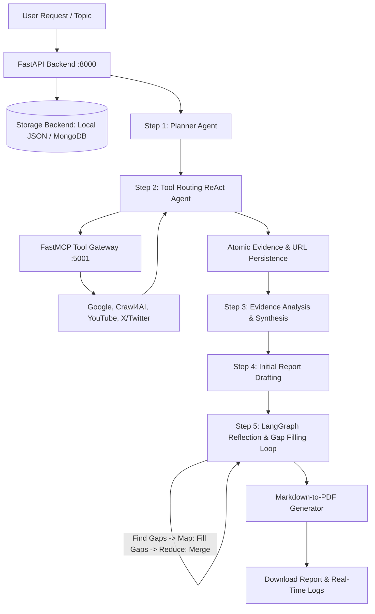

# Architectural Documentation: MarketScout

This document provides a comprehensive, production-grade architectural and technical analysis of the **MarketScout** system. It details the multi-agent orchestration state machine, tool execution layer via the Model Context Protocol (MCP), multi-model LLM routing, real-time evidence persistence, dual-storage backend, and step-by-step developer workflows.

---

## 1. Project Overview

### What problem does this project solve?
Traditional market research is slow, fragmented, and prone to hallucinations. Analysts must search search engines, monitor social platforms (X/Twitter), inspect video transcripts (YouTube), and scrape web pages to extract insights. 

**MarketScout** automates deep market intelligence by orchestrating a multi-agent AI system that plans research, executes specialized tools via MCP, verifies and synthesizes evidence, drafts comprehensive reports, reflects on knowledge gaps through a LangGraph Map-Reduce loop, and exports polished PDF documents.

### Research Analysis Workflows
MarketScout supports 6 distinct market research workflows:
1. **Industry Analysis** (`industry_analysis` / `Industry Report`): Market size, growth drivers, value chain, regulatory landscape, and trends.
2. **Competitor Analysis** (`competitor_analysis` / `Competitor Report`): Competitor profiling, feature matrices, pricing models, strengths, weaknesses, and market positioning.
3. **Market Gap Analysis** (`market_gap_analysis` / `Market Gap Report`): Unmet customer needs, underserved segments, technological voids, and product-market fit opportunities.
4. **Target Market Segmentation** (`target_market_analysis` / `Target Market Report`): Demographic, firmographic, psychographic, and behavioral customer segmentation.
5. **Barrier Assessment** (`barrier_analysis` / `Barrier Report`): Regulatory barriers, capital requirements, distribution moats, switching costs, and IP hurdles.
6. **Sales Forecasting** (`sales_forecasting` / `Sales Forecast Report`): Multi-scenario demand projections (Bear/Base/Bull), unit economics, pricing elasticity, and revenue drivers.

### High-Level Workflow


---

## 2. Overall Architecture

MarketScout is built around a **Modular Micro-Services & Agentic Architecture**. It separates the execution of the agent state machine (the orchestrator) from the tool execution layer (data collectors) using the **Model Context Protocol (MCP)** over Server-Sent Events (SSE).

```
                            ┌────────────────┐
                            │     Users      │
                            └───────┬────────┘
                                    │ HTTP / WebSocket
                                    ▼
                      ┌──────────────────────────────┐
                      │   Frontend (React/Next.js)   │
                      │    or CLI / Terminal Tool    │
                      └──────────────┬───────────────┘
                                     │
                        HTTP POST    │ WebSocket
                        /analysis    │ /ws/research/{id}
                                     ▼
                      ┌──────────────────────────────┐
                      │      Backend (FastAPI)       │
                      │          (Port 8000)         │
                      └─────┬────────┬────────┬──────┘
                            │        │        │
                            │        │        │ Run LangGraph Engine
                Write/Read  │        │        └──────────────┐
                Metadata &  │        │                       │
                Evidence    │        │ Serve PDF             ▼
                            ▼        │ /reports/... ┌─────────────────┐
                      ┌───────────┐  │              │    LangGraph    │
                      │  Storage  │  │              │  Agent workflow │
                      │  Backend  │  │              └────────┬────────┘
                      │(Local/DB) │  │                       │
                      └───────────┘  ▼                       │ Run Tools
                              ┌─────────────┐                │ (MCP SSE Client)
                              │ Local PDF   │◄───────────────┤ 
                              │ Storage     │ (Saves PDF)    │
                              └─────────────┘                ▼
                                                    ┌─────────────────┐
                                                    │   MCP Gateway   │
                                                    │   (FastAPI)     │
                                                    │   (Port 5001)   │
                                                    └────────┬────────┘
                                                             │ SSE Transports
                                                             ▼
                                                    ┌─────────────────┐
                                                    │   FastMCP Tool  │
                                                    │     Servers     │
                                                    └────────┬────────┘
                                                             │
                      ┌──────────────────────────────────────┼──────────────────────────────────────┐
                      │                      │               │                      │               │
                      ▼                      ▼               ▼                      ▼               ▼
              ┌──────────────┐        ┌──────────────┐ ┌───────────┐        ┌──────────────┐
              │ google_tools │        │ scraper_tools│ │youtube_tools │     │   x_tools    │
              └──────┬───────┘        └─────┬────────┘ └──────┬───────┘     └──────┬───────┘
                     │                      │                 │                    │
                     ▼                      ▼                 ▼                    ▼
                 Google APIs            Crawl4AI            YouTube           X API v2 &
               (Search, Trends,        Scraper API        Transcripts       SERP Fallback
               Shopping, News)
```

### Architectural Tiers:
1. **Frontend / Terminal Client**: 
   - Interactive React/Next.js UI or terminal test harness (`tests/run_terminal_research.py`).
   - Submits structured analysis requests, listens to real-time execution logs via WebSockets, and downloads generated PDF reports.
2. **Backend Gateway (FastAPI, Port 8000)**: 
   - REST API handling request validation (`CreateAnalysisRequest`), storage persistence, PDF file serving, and WebSocket streaming.
   - Spawns background worker tasks via `asyncio.create_task` and dispatches streaming updates through an in-memory queue.
3. **Pluggable Storage Backend (`database/storage.py`)**:
   - Dual-mode storage: **`LocalFileStorage`** (zero-dependency JSON storage in `data/analyses/`) or **`MongoStorage`** (MongoDB Atlas/community).
   - Real-time atomic persistence of search evidence, citation URLs, and intermediate report drafts.
   - Global query cache (`data/search_cache.json` / Mongo `search_cache`) to avoid duplicate external API calls.
4. **Agent Orchestrator & State Machine (`agents/`)**:
   - Linear preparation pipeline: **Planner** $\rightarrow$ **Tool Routing ReAct Agent** $\rightarrow$ **Evidence Synthesizer** $\rightarrow$ **Report Writer**.
   - Cyclic self-correction engine: **LangGraph Map-Reduce loop** that discovers gaps, executes targeted tool searches in parallel, and merges findings up to $k$ iterations based on `research_depth`.
5. **Model Context Protocol (MCP) Gateway (Port 5001)**:
   - FastAPI server mounting FastMCP servers via Server-Sent Events (`/mcp/{server}/sse`).
   - Integrates Google Search & Shopping, Crawl4AI web scrapers, YouTube transcript fetchers, and X (Twitter) social analyzers.
6. **Multi-Model LLM Routing**:
   - Supports Google Gemini, Ollama (local models like `llama3.2:3b`, `phi3:mini`, `gemma3:1b`), Groq, Jan AI, and Hugging Face.
   - Distinct model configurations per pipeline stage (`PLANNER_MODEL`, `TOOL_ROUTING_MODEL`, `EVIDENCE_ANALYSIS_MODEL`, `REPORT_WRITING_MODEL`, `REPORT_REVIEW_MODEL`).

---

## 3. End-to-End Execution Flow

```
User/Client       FastAPI (8000)       Storage Backend      Planner & ReAct       MCP Gateway (5001)    LangGraph Loop
    │                   │                    │                     │                      │                  │
    │──[1] POST /anal.─>│                    │                     │                      │                  │
    │                   │──[2] Save Analysis>│                     │                      │                  │
    │                   │      (Pending)     │                     │                      │                  │
    │<──[3] Return ID───│                    │                     │                      │                  │
    │                   │──[4] Spawn Task ────────────────────────>│                      │                  │
    │──[5] Open WS ────>│                    │                     │                      │                  │
    │                   │                    │                     │──Step 1: Plan───────>│                  │
    │                   │                    │                     │──Step 2: Tool Run ──>│                  │
    │                   │                    │                     │                      │──Run Tools──────>│
    │                   │                    │                     │<─Tool Results────────│<──Data/URLs──────│
    │                   │                    │<──Push Evidence─────│                      │                  │
    │<──[6] WS Logs ────│<──Queue Stream─────│                     │──Step 3: Synthesis──>│                  │
    │                   │                    │<──Save Draft────────│──Step 4: Draft──────>│                  │
    │                   │                    │                     │                      │                  │
    │                   │                    │                     │──Step 5: Invoke Graph──────────────────>│
    │                   │                    │                     │                      │                  │──Find Gaps
    │                   │                    │                     │                      │                  │──Parallel Fill
    │                   │                    │                     │                      │                  │──Merge Gaps
    │                   │                    │                     │                      │                  │  (k iterations)
    │                   │                    │<──Update Draft──────│<─Final Report───────────────────────────│
    │                   │                    │                     │──Compile PDF         │                  │
    │                   │                    │<──Set Completed─────│                      │                  │
    │<──[7] Close WS ───│<──Sentinel None────│                     │                      │                  │
    │                   │                    │                     │                      │                  │
    │──[8] GET /rep.───>│                    │                     │                      │                  │
    │<──[9] Return PDF──│                    │                     │                      │                  │
```

### Detailed Pipeline Steps:
1. **Submission (`POST /analysis`)**: Client submits market topic, analysis type, geography, research depth (`quick`, `comprehensive`, `deep_research`), objective, and context.
2. **Storage Initialized**: Storage creates document with status `pending`, generates a 24-character hexadecimal ID, and initializes the in-memory queue.
3. **Step 1 — Planner Agent**: The `PLANNER_MODEL` generates a structured research plan, questions to answer, required metrics, and search queries.
4. **Step 2 — Tool Routing (Evidence Gathering)**: A ReAct agent runs tools via MCP to collect web searches, social posts, video transcripts, and scraped articles. Tool outputs are automatically summarized, and every result + extracted URL is **atomically persisted** to storage.
5. **Step 3 — Evidence Analysis & Synthesis**: The `EVIDENCE_ANALYSIS_MODEL` extracts key quantitative statistics, player market shares, regulatory facts, and links with citation verification.
6. **Step 4 — Initial Report Drafting**: The `REPORT_WRITING_MODEL` produces the initial comprehensive draft adhering to domain prompt guidelines. The draft is immediately saved to disk/DB.
7. **Step 5 — LangGraph Map-Reduce Reflection Loop**:
   - `find_gaps`: The `REPORT_REVIEW_MODEL` analyzes the draft and outputs structured knowledge gaps.
   - `continue_to_fill_gaps`: Maps each gap into parallel execution branches using LangGraph's `Send` API.
   - `fill_gaps`: Parallel ReAct agent instances fetch missing metrics and data.
   - `merge_filled_gaps`: Reduces and synthesizes newly discovered data back into the main report text.
   - Evaluates iteration limit ($k=2$ for `quick`, $k=3$ for `comprehensive`, $k=5$ for `deep_research`). Repeats if $k$ is not reached.
8. **PDF Generation & Completion**: `MarkdownPdf` builds a PDF in `reports/{analysis_id}/{type}.pdf`. Storage status is updated to `completed` and the download path is emitted over WebSocket.

---

## 4. Component Breakdown

* **FastAPI Gateway (`server.py`)**:
  - Handles `/analysis`, `/analysis/{id}`, `/reports/...`, and `/ws/research/{id}`.
  - Manages asynchronous worker tasks and WebSocket queue piping.
  - Houses the `PROMPTS_REGISTRY` mapping each `AnalysisType` to domain prompts.
* **Storage Abstraction Layer (`database/storage.py`)**:
  - Abstract base class `StorageBackend` with concrete implementations: `LocalFileStorage` and `MongoStorage`.
  - Thread-safe local file operations using mutex locks.
  - Persistent query cache (`search_cache`) to prevent redundant tool executions.
* **Real-Time Memory & Evidence Tracker (`database/memory.py`)**:
  - `record_tool_evidence`: Persists every search call with timestamp, tool name, query/URL, content preview, and extracted URLs.
  - `record_draft_report`: Persists intermediate drafts so progress is never lost during long runs.
* **Agent Factory (`agents/create_agent.py`)**:
  - Orchestrates the 5-step research pipeline and handles PDF generation and failure states.
* **LangGraph Engine (`agents/graph.py`)**:
  - Defines the cyclical StateGraph (`find_gaps` $\rightarrow$ `fill_gaps` $\rightarrow$ `merge_filled_gaps` $\rightarrow$ `route_loop`).
  - Implements robust JSON parsing with fallback line extraction for gap reflection.
* **Model Context Protocol Servers (`mcp_servers/`)**:
  - `google_tools`: Google Search, Shopping, News, and Google Trends via SerpAPI.
  - `scraper_tools`: Async Crawl4AI scraper converting web pages into clean markdown.
  - `youtube_tools`: Robust YouTube video ID parsing and transcript extraction.
  - `x_tools`: X (Twitter) API v2 client with fallback to SERP web indexing.
* **Prompt Engineering Hub (`prompts/`)**:
  - Individual prompt suites for Industry, Competitor, Market Gap, Target Market, Barrier, and Sales Forecast reports, plus Planner instructions.

---

## 5. Folder Structure

```
server/
├── server.py                   # FastAPI main entrypoint, REST & WebSocket endpoints
├── requirements.txt            # Python dependencies (FastAPI, LangGraph, Crawl4AI, etc.)
├── .env.example                # Example environment variables template
├── config/
│   └── settings.py             # Centralized settings (LLM provider, storage, rate limits, keys)
├── agents/                     # LLM multi-agent core
│   ├── create_agent.py         # 5-step research pipeline orchestrator & PDF generation
│   ├── graph.py                # LangGraph StateGraph (map-reduce gap reflection)
│   ├── state.py                # AgentState schema & custom list reducers with reset
│   └── utils.py                # LLM model resolution, rate limiting, and backoff retries
├── database/                   # Data layer & persistence
│   ├── db.py                   # MongoDB client connection
│   ├── memory.py               # Real-time search evidence recording & URL extractor
│   ├── schema.py               # Pydantic schemas (CreateAnalysisRequest, AnalysisSchema, Enums)
│   └── storage.py              # Dual storage backend: LocalFileStorage & MongoStorage
├── data/                       # Local file storage directory (when STORAGE_BACKEND="local")
│   ├── analyses/               # Individual analysis JSON files ({analysis_id}.json)
│   └── search_cache.json       # Query deduplication cache
├── mcp_servers/                # Model Context Protocol tier (Port 5001)
│   ├── main.py                 # Mounts tool servers onto unified SSE endpoints
│   ├── google_tools/           # Google Search, Trends, News, and Shopping
│   ├── scraper_tools/          # Crawl4AI web crawler
│   ├── youtube_tools/          # YouTube transcript retrieval
│   └── x_tools/                # X (Twitter) search & engagement metrics
├── prompts/                    # Domain-specific prompt templates
│   ├── barrier_assessment.py   # Barrier to entry report prompts
│   ├── competitive_analysis.py # Competitor analysis report prompts
│   ├── industry.py             # Industry analysis report prompts
│   ├── market_gap.py           # Market gap report prompts
│   ├── planner.py              # Master research planner prompt
│   ├── sales_forecast.py       # Sales forecast & demand projection prompts
│   └── target_market_segmentation.py # Target market & segmentation prompts
├── reports/                    # Output directory for generated PDF files
└── tests/                      # Testing & CLI tools
    ├── run_terminal_research.py# Terminal research runner with live WebSocket logs
    ├── test_models.py          # Model testing & validation benchmark
    ├── test_graph.py           # Graph logic tests
    └── view_db.py              # Database/storage inspection script
```

---

## 6. Data Contracts & API Design

### 1. `POST /analysis`
Creates and kicks off a research task asynchronously.

**Request Payload (`CreateAnalysisRequest`):**
```json
{
  "market_topic": "B2B Remote Collaboration Software",
  "analysis_type": "sales_forecasting",
  "geography": "Global",
  "research_depth": "comprehensive",
  "objective": {
    "type": "estimate_future_demand",
    "description": "Estimate 3-year market demand and pricing trends"
  },
  "decision_question": "Should we enter the remote team productivity space in 2026?",
  "context": {
    "target_customer": "Mid-market tech companies",
    "business_stage": "exploring",
    "time_horizon": "3 Years",
    "competitors": ["Slack", "Notion", "Miro"],
    "forecast_period": "3 Years"
  },
  "model_name": null
}
```

* **Supported `analysis_type` values**:
  - `industry_analysis` (`Industry Report`)
  - `competitor_analysis` (`Competitor Report`)
  - `market_gap_analysis` (`Market Gap Report`)
  - `target_market_analysis` (`Target Market Report`)
  - `barrier_analysis` (`Barrier Report`)
  - `sales_forecasting` (`Sales Forecast Report`)

* **Supported `research_depth` values**:
  - `quick`: 2 reflection iterations ($k=2$)
  - `comprehensive`: 3 reflection iterations ($k=3$, default)
  - `deep_research`: 5 reflection iterations ($k=5$)

**Response:**
```json
{
  "id": "da52f47236fcaa595a21de1e",
  "status": "created"
}
```

### 2. `GET /analysis/{analysis_id}`
Retrieves full record status, parameters, intermediate drafts, report path, and real-time evidence collected.

### 3. `WS /ws/research/{request_id}`
Streams real-time agent thoughts, tool invocations, argument payloads, reflection progress, and completion events.
- Emits `__OUTPUT_FILE__reports/{id}/{file}.pdf` on completion.
- Emits `__ERROR__{message}` if pipeline encounters an unrecoverable failure.

### 4. `GET /reports/{rid}/{file_id}`
Safely serves generated PDF reports with built-in path-traversal validation.

---

## 7. Storage Architecture & Evidence Persistence

MarketScout implements a pluggable storage layer via `database/storage.py`.

```
                  ┌───────────────────────────────┐
                  │      StorageBackend (ABC)     │
                  └───────────────┬───────────────┘
                                  │
                  ┌───────────────┴───────────────┐
                  ▼                               ▼
       ┌────────────────────┐          ┌────────────────────┐
       │  LocalFileStorage  │          │    MongoStorage    │
       │(Default, Zero-Dep) │          │  (MongoDB Atlas)   │
       └────────────────────┘          └────────────────────┘
```

### 1. `LocalFileStorage` (Default)
- Stores analyses as formatted JSON documents in `data/analyses/{analysis_id}.json`.
- Requires **no external database** to run locally.
- Thread-safe file writes using Python `threading.Lock`.
- Automatically falls back to `LocalFileStorage` if MongoDB is configured but unreachable.

### 2. Real-Time Evidence Logging (`database/memory.py`)
Every tool execution records a `SearchEvidenceItem`:
```json
{
  "timestamp": "Sun Aug 23 13:02:15 2026",
  "stage": "initial_research",
  "tool_name": "search_google_news",
  "query_or_url": "b2b remote collaboration software trends",
  "content_snippet": "Market growth projections indicate a 14.2% CAGR...",
  "extracted_urls": [
    "https://www.pcmag.com/picks/the-best-online-collaboration-software",
    "https://www.techradar.com/best/best-cloud-storage"
  ]
}
```
* **Why this matters**:
  - **Zero data loss**: If a rate limit or network timeout occurs later in the run, all research evidence and links collected up to that point remain saved on disk.
  - **Auditability**: Analysts can inspect raw snippets and verified citation sources.
  - **Search Caching**: Search results are cached by normalized keys (`{tool_name}:{query}`) in `data/search_cache.json` to prevent repetitive API calls.

---

## 8. Multi-Model Pipeline & Configuration

MarketScout features a multi-model architecture where different steps in the research lifecycle can be assigned to different LLMs based on performance and budget:

| Pipeline Stage | Environment Variable | Default Model | Responsibility |
|---|---|---|---|
| **Fallback / Multipurpose** | `MULTIPURPOSE_MODEL` | `gemini-2.0-flash` / `llama3.2:3b` | General tasks & defaults |
| **Planner** | `PLANNER_MODEL` | `gemini-2.0-flash` / `llama3.2:3b` | Outlining research strategy & sub-queries |
| **Tool Routing** | `TOOL_ROUTING_MODEL` | `gemini-2.0-flash` / `llama3.2:3b` | ReAct agent tool invocation & evidence gathering |
| **Tool Summarizer** | `SUMMARIZATION_MODEL` | `gemini-2.0-flash` / `llama3.2:3b` | Compressing lengthy scraping outputs |
| **Evidence Analysis** | `EVIDENCE_ANALYSIS_MODEL` | `gemini-2.0-flash` / `llama3.2:3b` | Fact synthesis, numerical extraction & URL checks |
| **Report Writing** | `REPORT_WRITING_MODEL` | `gemini-2.0-flash` / `llama3.2:3b` | Drafting sections & merging gap results |
| **Report Review (Gaps)**| `REPORT_REVIEW_MODEL` | `gemini-2.0-flash` / `llama3.2:3b` | Critic LLM identifying knowledge gaps |

### Supported Providers:
1. **Google Gemini**: Set `LLM_PROVIDER="google"` and supply `GOOGLE_API_KEY`. (Default model: `gemini-2.0-flash`).
2. **Ollama (Local Models)**: Set `LLM_PROVIDER="ollama"`, `OLLAMA_BASE_URL="http://localhost:11434"`.
   - Recommended local models:
     - `llama3.2:3b` (Fast, high quality, minimal RAM pressure)
     - `gemma3:1b` (Ultra-lightweight)
     - `phi3:mini` (Fast and capable)
3. **Groq**: Set `LLM_PROVIDER="groq"`, `GROQ_API_KEY="..."`, `GROQ_MODEL="llama-3.3-70b-versatile"`.
4. **Jan AI**: Set `LLM_PROVIDER="jan"`, `JAN_API_BASE="http://localhost:1337/v1"`.
5. **Hugging Face**: Set `LLM_PROVIDER="huggingface"`, `HUGGINGFACEHUB_API_TOKEN="..."`.

### Gemini Rate Limiting & Transient Failure Handling
To avoid `429 Quota Exceeded` errors when operating on Google Free Tier accounts:
- **`InMemoryRateLimiter`**: Regulates outgoing requests (configurable via `GOOGLE_RATE_LIMIT_RPS`, default `0.5` rps).
- **Exponential Backoff**: `call_llm_with_backoff` automatically retries requests on transient failures (up to 7 retries with jitter).

---

## 9. Getting Started & Local Development

### Prerequisites
- **Python**: 3.10, 3.11, or 3.12.
- **Node.js**: (Optional) For the frontend UI.
- **Ollama**: (Optional) If running local models (`brew install ollama && ollama run llama3.2:3b`).
- **MongoDB**: (Optional) Only required if `STORAGE_BACKEND="mongodb"`.

### 1. Installation
```bash
# Navigate to server
cd server

# Create and activate virtual environment
python3 -m venv .venv
source .venv/bin/activate

# Install dependencies
pip install --upgrade pip
pip install -r requirements.txt
```

### 2. Environment Configuration
Copy `.env.example` to `.env` and fill in your keys:
```bash
cp .env.example .env
```
Key variables to review:
```env
# Storage (Default is local JSON in data/)
STORAGE_BACKEND="local"
DATA_DIR="data"

# LLM Provider: 'google', 'ollama', 'groq', 'jan', or 'huggingface'
LLM_PROVIDER="google"
GOOGLE_API_KEY="your-google-api-key"

# Search APIs
SERP_DEV_API_KEY="your-serp-api-key"
```

### 3. Starting the Services

**Terminal 1 — Run the FastMCP Gateway (Port 5001):**
```bash
python -m mcp_servers.main
```

**Terminal 2 — Run the FastAPI Server (Port 8000):**
```bash
python server.py
```

FastAPI will start at `http://localhost:8000`. You can inspect interactive API documentation at `http://localhost:8000/docs`.

---

## 10. CLI Research Runner & Testing

MarketScout includes built-in terminal utilities to run and test research without needing the web UI.

### Running Research via Terminal
Run an end-to-end research query with real-time streaming logs:
```bash
python tests/run_terminal_research.py \
  --topic "Autonomous Drone Delivery for Groceries" \
  --type sales_forecasting \
  --depth quick
```
Options:
- `--topic`: Any market research question or business topic.
- `--type`: `sales_forecasting`, `industry_analysis`, `competitor_analysis`, `market_gap_analysis`, `target_market_analysis`, or `barrier_analysis`.
- `--depth`: `quick` ($k=2$), `comprehensive` ($k=3$), or `deep_research` ($k=5$).

### Testing LLM Models
Validate your configured LLM models (cloud or local Ollama/Jan models):
```bash
python tests/test_models.py
```

### Inspecting Stored Data
View saved analyses from local storage or MongoDB:
```bash
python tests/view_db.py
```

---

## 11. Security, Resilience & Production Scaling

1. **Path Traversal Guard**: Endpoint `/reports/{rid}/{file_id}` verifies that file paths cannot traverse out of the designated output directory.
2. **Atomic Evidence Persistence**: Search results are committed before calling subsequent LLM chains, safeguarding research against memory crashes.
3. **Structured Logging**: Rich console logging with contextual loggers (`market_scout`, `market_scout.agent`, `market_scout.graph`, `market_scout.storage`).
4. **Scaling to Production**:
   - **Task Workers**: Replace in-process `asyncio.create_task` with **Celery / Redis** or **Arq** workers for horizontal scaling.
   - **Distributed Storage**: Transition `reports/` to an **Amazon S3** or **Google Cloud Storage** bucket.
   - **Proxy Rotation**: Route Crawl4AI scraping requests through rotating proxies (e.g., Bright Data) to prevent rate limits.
   - **Redis Pub/Sub**: Stream WebSocket logs across multi-instance backend containers using a Redis Pub/Sub channel.

---

## 12. Interview Explanation Guide

Use this structure to explain MarketScout in technical interviews:

> "I architected **MarketScout**, an autonomous multi-agent market intelligence platform that automates complex market research workflows—such as competitor analysis, industry reports, and sales forecasting.
>
> **The Problem**: Traditional market research is manual, fragmented across web search, social platforms, and video transcripts, and easily prone to LLM hallucinations when not grounded in verified data.
>
> **The Architecture**: 
> 1. I built a decoupled system using **FastAPI** and the **Model Context Protocol (MCP)**. The core AI brain connects to independent FastMCP tool microservices running Google Search, Crawl4AI web scrapers, YouTube transcript extractors, and X (Twitter) APIs over Server-Sent Events (SSE).
> 2. For execution, I designed a multi-stage pipeline: a **Planner Agent** designs a search strategy, a **ReAct Agent** executes tools with real-time atomic evidence and citation logging, an **Evidence Synthesizer** verifies facts and links, and a **Writer Agent** produces the initial report.
> 3. To guarantee depth and self-correction, I implemented a **LangGraph Map-Reduce loop**: a critic node discovers knowledge gaps, branches out parallel workers using the LangGraph `Send` API to research missing points via MCP, and merges findings back into the report across configurable research depths ($k=2, 3, 5$).
> 4. I introduced a pluggable storage layer supporting both local file-based JSON storage for zero-dependency local use and MongoDB Atlas for production, combined with multi-provider LLM support across Google Gemini, Ollama local models, and Groq."
